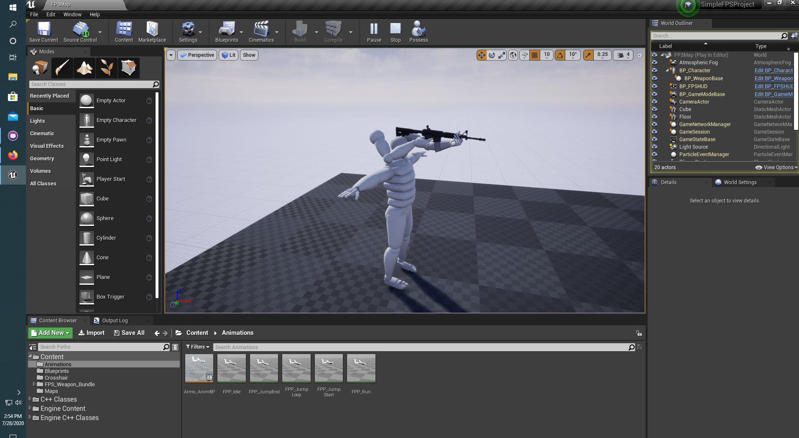
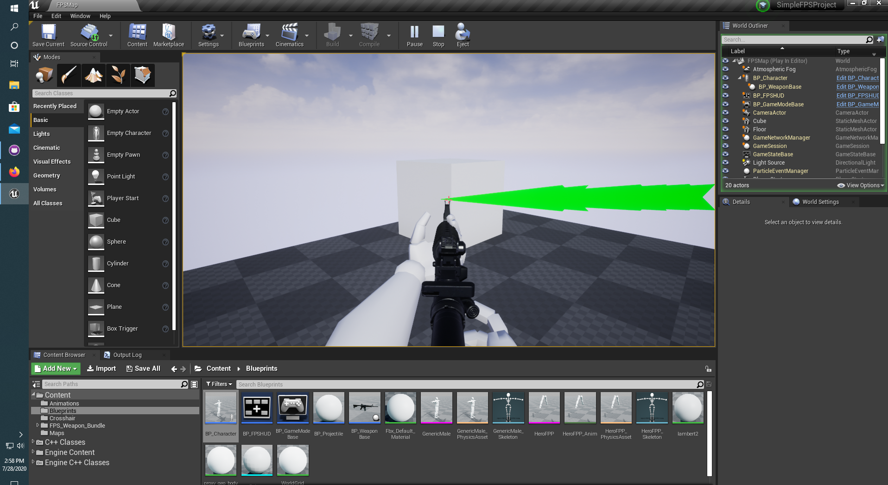

# SimpleFPSProject

Developed with Unreal Engine 4. Following the Unreal Engine First Person Shooter tutorial, created a first person character that the ability to be controller and played. The character's abilities include forward and horizontal movement, jumping, and possesing and firing a weapon.The firing mechanic involves a line tracing from the first person camera. Using two separate meshes, One mesh, the first person mesh, is used to represent the controlling players point of view. While the third person mesh, is ignored by the controlling player and only visible to other players, if applicable.

